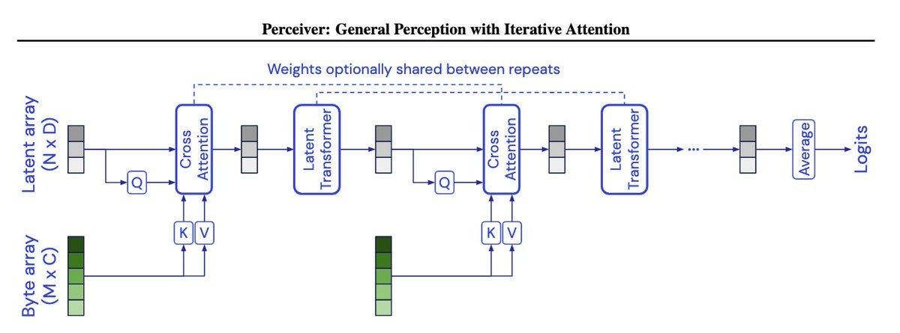
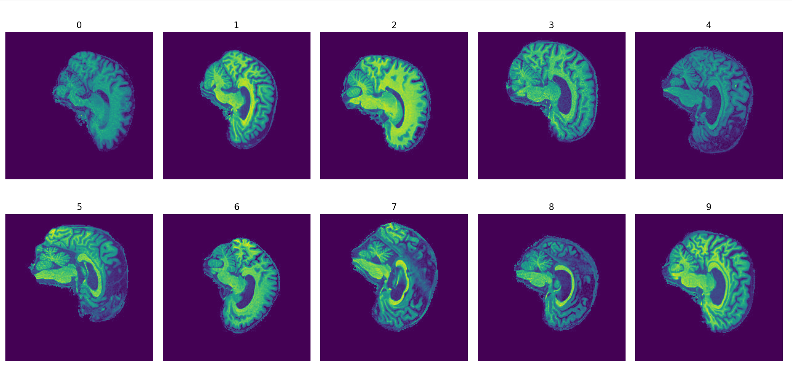
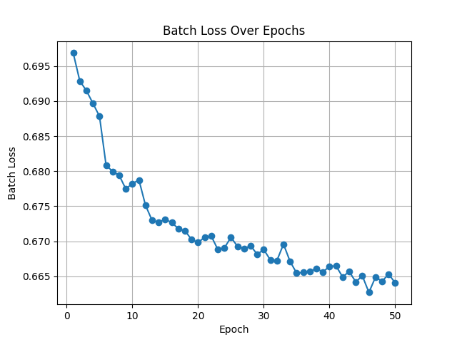
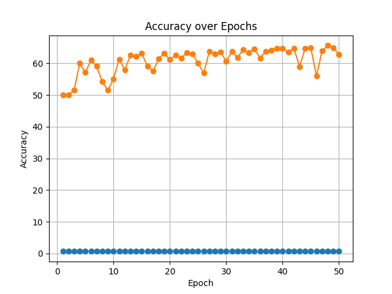

# Classify Alzheimer’s disease of the ADNI brain data using perceiver transformer
### By Rohan Kollambalath

## Introduction

In this project I use the perceiver transformer to classify if MRI brain scans have Alzheimers disease with the ADNI dataset. The goal of the project was to achieve above 80% accuracy in the test set and produce a model that does not make too many assumtions about the input data.

The Perciever Transformer is an iteration of the transformer model released by Google Deep-Mind to solve its quadratic bottleneck and modalility limitations. [1]: [Perceiver: General Perception with Iterative Attention] (https://arxiv.org/pdf/2103.03206.pdf)

it solves the quadratic bottleneck by projecting the input information into a lower dimention latent array through cross attention layers similar to those in traditional transformers. The array is then processed through multiple self attention layers to extract features. This process also allows the perciever to make less structural assumptions about the input data allowing for many different modes of data as inputs including text, audio, video etc. 

## Set-Up and Dependencies
This project uses pytorch to build the perceiver in the same regard as the original paper. I used object oriented programming for all the components of the model and dataloader. 
Architectural decisions for this model were influenced by "The Annotated Perciever" article [2]: [The Annotated Perceiver](https://medium.com/@curttigges/the-annotated-perceiver-74752113eefb) as well as the original paper [1]: [Perceiver: General perception with iterative attention. In International conference on machine learning](https://arxiv.org/abs/2103.03206)

Dependencies:
 - Python 3.9.2
 - PyTorch 2.0.1
 - Matplotlib 3.7.1

## Implementation and Reproducability
This model follows the architecture proposed in the paper. It consists of 3 perciever blocks each consisting of a singular head cross attention module and 4 self attention modules with 8 heads each. A batch size of 32 was used with BCELoss criteron as this is a binary classification problem. The adam optimiser was used instead of the LAMB optimiser proposed in the model.

HyperParameters:
 -  LATENT_DIM = 32
 -  LATENT_EMB = 64
 -  latent_layers = 4
 -  latent_heads = 8
 -  classifier_out = 16
 -  batch_size = 32
 -  epochs = 50
 -  depth=3
 -  learning_rate = 0.005

To train your model run the file train.py with your desired hyperparameters or instantiate a new model with
 -  ADNI_Transformer(depth, LATENT_DIM, LATENT_EMB, latent_layers, latent_heads, classifier_out, batch_size)

### Data Processing
The ADNI dataset has already been split into adequate test and train folders by the teaching team. The datasets have both AD (has alzheimers) and ND (no alzheimers) labels. I used pytorch to load the data into a dataloeader with a batch size of 32. Transformations were applied to the data including random cropping images from 240x256 to 240x240 as well as converting to black and white. Other augmentations including random flips and guassian blur were also added later on to aid in the generalisation of the model. The data was also normalised to a calculated mean of 0.1232 and an std of 0.2308. Normalisation to mean of 0 and std of 1 lead to an inability for the model to converge.

The data split given was 70% train and 30% test. There were a total of 30,000 images whith 21000 in the training set. I took 2 thousand images out of the train set to produce a validation set leaving the final percentage of the split 63% 7% 30% for train validation and test respectively. I only used 7% for validation as the dataset was already considerably small for training a transformer. Each patient has 20 scans in the dataset so I took extra caution to split my validation set on patient id taking 50 patients with and without alzheimers(1000 AD and 1000 NC images) to prevent any form of data leakage. 

Example Brains without random augmentations:  
Note, matplotlib automatically adds contrast colour when displaying image as the colour dimention is only 1

### Perceiver Modules
The perceiver consists of multiple modules that can be effectively modeled with object oriented programming. The components of the perciever include cross-attention and multi head latent transformers (self attention). A generic attention block was made with the same layers as mentioned in the paper. Nomalisation, attention, linear layers and GELU. Skip connections were added between attention blocks as mentioned in the paper. Cross attention implements the attention layer with a single head between the latent and the image as specified in the paper. The latent transformer implements 8 latent heads with 4 total attention layers for self attention. The cross attention and Latent transformer together make one perceiver block in the model of which 3 were used.  

### Image Encoding
Due to the nature of the perciever it is permuation invarient and cannot directly draw on spatial structures as well as other models. To mitigate this the paper reccomended two options, fourier positional encodings or a learned array of embeddings. This project opts to use the learned embeddings. The embeddings are appended onto the colour dimention of the data. The dimentions used are one less than the latent embedding, for example when latent embedding is 64 an image embedding layer of 63 is used.

### Classification
The classification layer reduces the 32x32x64 latent tensor to a 32x1 tensor for the binary output expected by BCELoss. It does this by passing through a fully connected layer followed by a mean on dimention 0 before another fully connected layer. The outputs are then passed through sigmoid before being returned. 

## Results and Discussion
After 50 epochs the model achieved an accruacy slightly above 57% on the testing set and around 65% on validation set whcih is slightly better than random guessing. I attempted many different hyperparameters to in order to get the accuracy up but each time test accuracy would plateu around 56 - 57 percent. Though the loss implies the model converges appropriately it is not general enough to score highly on the test set. The loss plot also indicates an inability for the model to learn adeptly and overfitting was not seen to be an issue.

I suspect this is in due part to the small size of the dataset, the training set had slightly less than 20000 images which is considered quite small when training transformer models whcih require very large amounts of data to generalise. As each patient had 20 sliced images in the dataset, the train set effectively only had 1000 unique brains to train on which may be why it struggles on completelty new brains in the test set. 

 Another reason could be the use of learned positional encodings over fourier encodings which might have made it difficult for the model to understand the positional relations in the brain scans. Percievers are known to struggle in this regard. The performance is likely also in due part to the 32x64 latent array which I used. I had to use this size due to memory contraints on both my laptop and the p100 gpus on rangpur which I primarily used to train the models with. Transformers are large complex models that benefit from scale which I was not able to provide.

 Resplitting the data to be 75% 5% 20% for train test and validation and implementing the fourier encodings mentioned in the paper may go a long way in improving the generalisation capabilities of the model. It may also be that for the scale of the given dataset, it might not be viable to use a model as demanding and complex as a transformer. Another option to boost performance could have been to use transfer learning from a Resnet pretrained on ImageNet. The resnet alone was found to achieve 71% on the test set. I attempted this initally but ultimately scrapped it midway through the project in favour of traditional positional encodings. 

## References
<a id="1">[1]</a>
Jaegle, A., Gimeno, F., Brock, A., Vinyals, O., Zisserman, A., & Carreira, J. (2021, July). Perceiver: General perception with iterative attention. In International conference on machine learning (pp. 4651-4664). PMLR.
 
<a id="2">[2]</a>
Curt Tigges. (Aug 20, 2022). "The Annotated Perceiver." Medium. [Link](https://medium.com/@curttigges/the-annotated-perceiver-74752113eefb)
